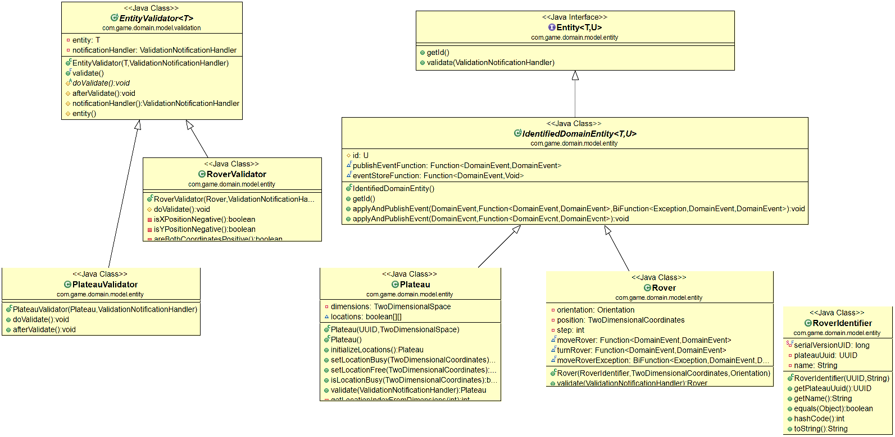
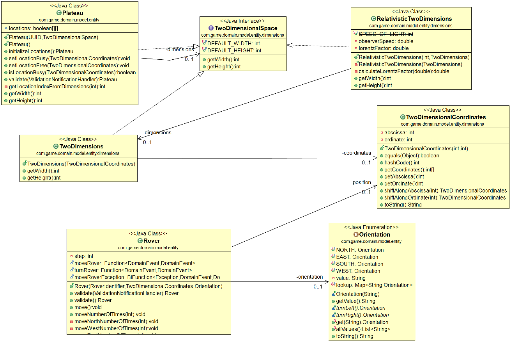
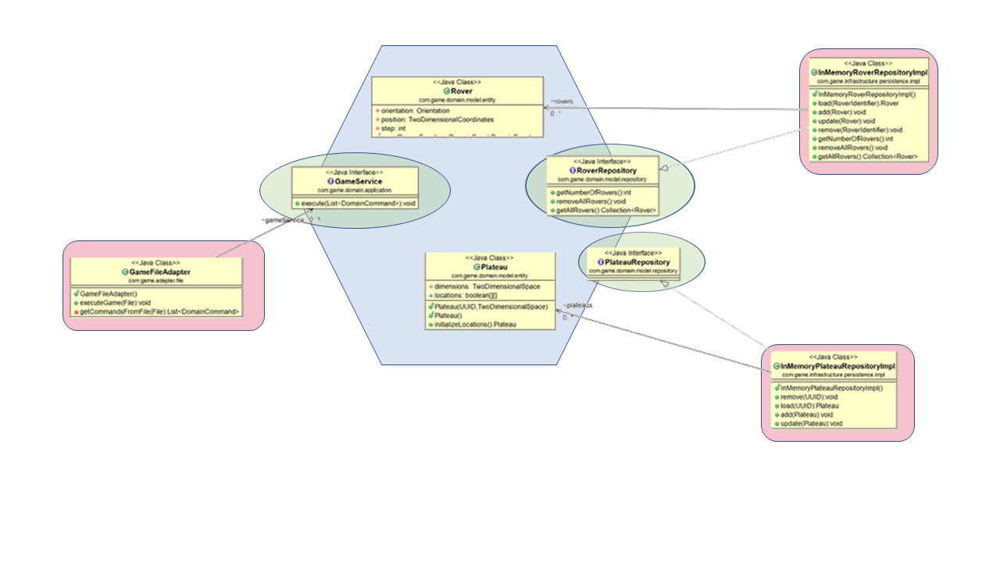
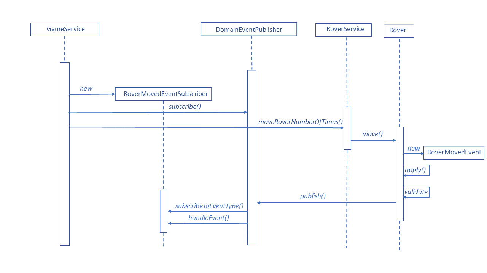
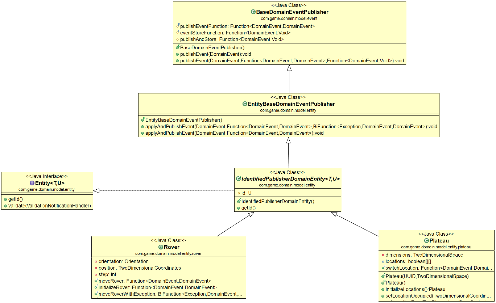

# ROVER Exercise
A squad of robotic rovers are to be landed by NASA on a plateau on Mars. This plateau, which is curiously rectangular, must be navigated by the rovers so that their on-board cameras can get a complete view of the surrounding terrain to send back to Earth.

## Context

The program expects input as follows:

```
5 5
1 2 N
LMLMLMLMM
3 3 E
MMRMMRMRRM
```

The first line of input is the upper-right coordinates of the plateau, the lower-left coordinates are assumed to be 0,0. 

The following input is information pertaining to the rovers that have been deployed, which gives the rover's position, which is made up of two integers and a letter separated by spaces, corresponding to the x and y co-ordinates and the rover's orientation. 

The second line is a series of instructions telling the rover how to explore the plateau and it expects an array of characters, where each character is a command for the robot. 'L' means "turn left", 'R' means "turn right" and 'M' means "move one step towards your direction".


## Objectives

In this exercise, we would like to present a step-by-step process driven by the three following software practices: `Domain-Driven Design`, `Event-Driven Design`, `Hexagonal Architecture` and `Test Driven Design`.

Furthemore, in addition to the initial requirements, this implementation offers the following extra-features:

- possibility to play on many plateaus at the same time.
- persistence of current state of all plateaus and attached rovers.
- persistence of all the events which occurred in the model in a dedicated event store.
- finer business exception handling with all the scenarii handled (rover moves out of the plateau, rover collides with another rover, rover wrongly initialized, etc.).
- possibility to send commands from any client (not limited to file parsing).
- possibility to create a relativistic plateau, i.e. whose dimensions obey Einstein's special relativity rules (more accurate for observers/NASA engineers moving close to speed of light).
- possibility to send commands in parallel, even for the same rover (concurrency handled by optimistic locking)


## Quick start

1. Download and install [maven](http://maven.apache.org/install.html).
2. Go to the root of the project and type `mvn clean install`. This will build the project.
3. In order to run the project, run `mvn exec:java`

You should see something similar to below extract:

Not only are we printing out the final position of both rovers, but we are showing the state of the in-memory and persistent plateau as well, and more importantly all the stored `Domain Events` which captured any occurrence of something that happened in the `Model`.


```java
Persistent Rover: Rover [ROVER_1] attached to Plateau [1fb95123-8fbf-4da2-979e-6bbca298e1b1] with [Coordinates [abscissa = 1, ordinate = 3]] and [Orientation [NORTH]]
Persistent Rover: Rover [ROVER_2] attached to Plateau [1fb95123-8fbf-4da2-979e-6bbca298e1b1] with [Coordinates [abscissa = 5, ordinate = 1]] and [Orientation [EAST]]
In-Memory Plateau with coordinates 1,3 busy ? [true]
In-Memory Plateau with coordinates 5,1 busy ? [true]
Persistent Plateau with coordinates 1,3 busy ? [true]
Persistent Plateau with coordinates 5,1 busy ? [true]
RoverInitializedEvent published at [2020-04-22T08:26:59.434938800] with rover id [Name [ROVER_1] - Plateau UUID [1fb95123-8fbf-4da2-979e-6bbca298e1b1]], position [Coordinates [abscissa = 1, ordinate = 2]], orientation [Orientation [NORTH]]
PlateauSwitchedLocationEvent published at [2020-04-22T08:26:59.453901100] with plateau id [1fb95123-8fbf-4da2-979e-6bbca298e1b1], position released [null], position occupied [Coordinates [abscissa = 1, ordinate = 2]]
RoverTurnedEvent published at [2020-04-22T08:26:59.459868] with rover id [Name [ROVER_1] - Plateau UUID [1fb95123-8fbf-4da2-979e-6bbca298e1b1]], previous orientation [Orientation [NORTH]], current orientation [Orientation [WEST]]
RoverMovedEvent published at [2020-04-22T08:26:59.474829300] with rover id [Name [ROVER_1] - Plateau UUID [1fb95123-8fbf-4da2-979e-6bbca298e1b1]], previous position [Coordinates [abscissa = 1, ordinate = 2]], current position [Coordinates [abscissa = 0, ordinate = 2]]
PlateauSwitchedLocationEvent published at [2020-04-22T08:26:59.476824300] with plateau id [1fb95123-8fbf-4da2-979e-6bbca298e1b1], position released [Coordinates [abscissa = 1, ordinate = 2]], position occupied [Coordinates [abscissa = 0, ordinate = 2]]
RoverTurnedEvent published at [2020-04-22T08:26:59.477819900] with rover id [Name [ROVER_1] - Plateau UUID [1fb95123-8fbf-4da2-979e-6bbca298e1b1]], previous orientation [Orientation [WEST]], current orientation [Orientation [SOUTH]]
RoverMovedEvent published at [2020-04-22T08:26:59.477819900] with rover id [Name [ROVER_1] - Plateau UUID [1fb95123-8fbf-4da2-979e-6bbca298e1b1]], previous position [Coordinates [abscissa = 0, ordinate = 2]], current position [Coordinates [abscissa = 0, ordinate = 1]]
PlateauSwitchedLocationEvent published at [2020-04-22T08:26:59.477819900] with plateau id [1fb95123-8fbf-4da2-979e-6bbca298e1b1], position released [Coordinates [abscissa = 0, ordinate = 2]], position occupied [Coordinates [abscissa = 0, ordinate = 1]]
RoverTurnedEvent published at [2020-04-22T08:26:59.477819900] with rover id [Name [ROVER_1] - Plateau UUID [1fb95123-8fbf-4da2-979e-6bbca298e1b1]], previous orientation [Orientation [SOUTH]], current orientation [Orientation [EAST]]
RoverMovedEvent published at [2020-04-22T08:26:59.477819900] with rover id [Name [ROVER_1] - Plateau UUID [1fb95123-8fbf-4da2-979e-6bbca298e1b1]], previous position [Coordinates [abscissa = 0, ordinate = 1]], current position [Coordinates [abscissa = 1, ordinate = 1]]
PlateauSwitchedLocationEvent published at [2020-04-22T08:26:59.477819900] with plateau id [1fb95123-8fbf-4da2-979e-6bbca298e1b1], position released [Coordinates [abscissa = 0, ordinate = 1]], position occupied [Coordinates [abscissa = 1, ordinate = 1]]
RoverTurnedEvent published at [2020-04-22T08:26:59.477819900] with rover id [Name [ROVER_1] - Plateau UUID [1fb95123-8fbf-4da2-979e-6bbca298e1b1]], previous orientation [Orientation [EAST]], current orientation [Orientation [NORTH]]
RoverMovedEvent published at [2020-04-22T08:26:59.478819100] with rover id [Name [ROVER_1] - Plateau UUID [1fb95123-8fbf-4da2-979e-6bbca298e1b1]], previous position [Coordinates [abscissa = 1, ordinate = 1]], current position [Coordinates [abscissa = 1, ordinate = 2]]
PlateauSwitchedLocationEvent published at [2020-04-22T08:26:59.478819100] with plateau id [1fb95123-8fbf-4da2-979e-6bbca298e1b1], position released [Coordinates [abscissa = 1, ordinate = 1]], position occupied [Coordinates [abscissa = 1, ordinate = 2]]
RoverMovedEvent published at [2020-04-22T08:26:59.478819100] with rover id [Name [ROVER_1] - Plateau UUID [1fb95123-8fbf-4da2-979e-6bbca298e1b1]], previous position [Coordinates [abscissa = 1, ordinate = 2]], current position [Coordinates [abscissa = 1, ordinate = 3]]
PlateauSwitchedLocationEvent published at [2020-04-22T08:26:59.478819100] with plateau id [1fb95123-8fbf-4da2-979e-6bbca298e1b1], position released [Coordinates [abscissa = 1, ordinate = 2]], position occupied [Coordinates [abscissa = 1, ordinate = 3]]
RoverInitializedEvent published at [2020-04-22T08:26:59.478819100] with rover id [Name [ROVER_2] - Plateau UUID [1fb95123-8fbf-4da2-979e-6bbca298e1b1]], position [Coordinates [abscissa = 3, ordinate = 3]], orientation [Orientation [EAST]]
PlateauSwitchedLocationEvent published at [2020-04-22T08:26:59.479814800] with plateau id [1fb95123-8fbf-4da2-979e-6bbca298e1b1], position released [null], position occupied [Coordinates [abscissa = 3, ordinate = 3]]
RoverMovedEvent published at [2020-04-22T08:26:59.479814800] with rover id [Name [ROVER_2] - Plateau UUID [1fb95123-8fbf-4da2-979e-6bbca298e1b1]], previous position [Coordinates [abscissa = 3, ordinate = 3]], current position [Coordinates [abscissa = 4, ordinate = 3]]
PlateauSwitchedLocationEvent published at [2020-04-22T08:26:59.479814800] with plateau id [1fb95123-8fbf-4da2-979e-6bbca298e1b1], position released [Coordinates [abscissa = 3, ordinate = 3]], position occupied [Coordinates [abscissa = 4, ordinate = 3]]
RoverMovedEvent published at [2020-04-22T08:26:59.479814800] with rover id [Name [ROVER_2] - Plateau UUID [1fb95123-8fbf-4da2-979e-6bbca298e1b1]], previous position [Coordinates [abscissa = 4, ordinate = 3]], current position [Coordinates [abscissa = 5, ordinate = 3]]
PlateauSwitchedLocationEvent published at [2020-04-22T08:26:59.479814800] with plateau id [1fb95123-8fbf-4da2-979e-6bbca298e1b1], position released [Coordinates [abscissa = 4, ordinate = 3]], position occupied [Coordinates [abscissa = 5, ordinate = 3]]
RoverTurnedEvent published at [2020-04-22T08:26:59.480813300] with rover id [Name [ROVER_2] - Plateau UUID [1fb95123-8fbf-4da2-979e-6bbca298e1b1]], previous orientation [Orientation [EAST]], current orientation [Orientation [SOUTH]]
RoverMovedEvent published at [2020-04-22T08:26:59.480813300] with rover id [Name [ROVER_2] - Plateau UUID [1fb95123-8fbf-4da2-979e-6bbca298e1b1]], previous position [Coordinates [abscissa = 5, ordinate = 3]], current position [Coordinates [abscissa = 5, ordinate = 2]]
PlateauSwitchedLocationEvent published at [2020-04-22T08:26:59.480813300] with plateau id [1fb95123-8fbf-4da2-979e-6bbca298e1b1], position released [Coordinates [abscissa = 5, ordinate = 3]], position occupied [Coordinates [abscissa = 5, ordinate = 2]]
RoverMovedEvent published at [2020-04-22T08:26:59.480813300] with rover id [Name [ROVER_2] - Plateau UUID [1fb95123-8fbf-4da2-979e-6bbca298e1b1]], previous position [Coordinates [abscissa = 5, ordinate = 2]], current position [Coordinates [abscissa = 5, ordinate = 1]]
PlateauSwitchedLocationEvent published at [2020-04-22T08:26:59.481810900] with plateau id [1fb95123-8fbf-4da2-979e-6bbca298e1b1], position released [Coordinates [abscissa = 5, ordinate = 2]], position occupied [Coordinates [abscissa = 5, ordinate = 1]]
RoverTurnedEvent published at [2020-04-22T08:26:59.481810900] with rover id [Name [ROVER_2] - Plateau UUID [1fb95123-8fbf-4da2-979e-6bbca298e1b1]], previous orientation [Orientation [SOUTH]], current orientation [Orientation [WEST]]
RoverMovedEvent published at [2020-04-22T08:26:59.481810900] with rover id [Name [ROVER_2] - Plateau UUID [1fb95123-8fbf-4da2-979e-6bbca298e1b1]], previous position [Coordinates [abscissa = 5, ordinate = 1]], current position [Coordinates [abscissa = 4, ordinate = 1]]
PlateauSwitchedLocationEvent published at [2020-04-22T08:26:59.481810900] with plateau id [1fb95123-8fbf-4da2-979e-6bbca298e1b1], position released [Coordinates [abscissa = 5, ordinate = 1]], position occupied [Coordinates [abscissa = 4, ordinate = 1]]
RoverTurnedEvent published at [2020-04-22T08:26:59.481810900] with rover id [Name [ROVER_2] - Plateau UUID [1fb95123-8fbf-4da2-979e-6bbca298e1b1]], previous orientation [Orientation [WEST]], current orientation [Orientation [NORTH]]
RoverTurnedEvent published at [2020-04-22T08:26:59.481810900] with rover id [Name [ROVER_2] - Plateau UUID [1fb95123-8fbf-4da2-979e-6bbca298e1b1]], previous orientation [Orientation [NORTH]], current orientation [Orientation [EAST]]
RoverMovedEvent published at [2020-04-22T08:26:59.482806900] with rover id [Name [ROVER_2] - Plateau UUID [1fb95123-8fbf-4da2-979e-6bbca298e1b1]], previous position [Coordinates [abscissa = 4, ordinate = 1]], current position [Coordinates [abscissa = 5, ordinate = 1]]
PlateauSwitchedLocationEvent published at [2020-04-22T08:26:59.482806900] with plateau id [1fb95123-8fbf-4da2-979e-6bbca298e1b1], position released [Coordinates [abscissa = 4, ordinate = 1]], position occupied [Coordinates [abscissa = 5, ordinate = 1]]
s
```

### Domain Driven Design 

> Domain-driven design (DDD) is an approach to software development placing the project's primary focus on the core domain and domain logic, which aims at connecting the implementation to an evolving model. The term was coined by Eric Evans in his book of the same title.

Our primary concern, before focusing on the input file parsing, should be to identify the main components of our domain.


The Domain Driven Design usually recommands to define the following elements:
 
##### Application Services

 An `Application Service` is inside the domain boundary and acts as a facade between the client and the domain. Its responsibilities, among others are:
  - to map the [ApplicationCommand](src/main/java/com/game/domain/application/command/ApplicationCommand.java) objects, i.e. the instructions received from the outside world to the objects understood by the model and to start the execution of the domain logic by calling the `Domain Services`.
  - to acts as a service orchestration by integrating two or more `Domain Services`.
  - to register the required `Event Subscribers` (in case of event-driven applications).
  - to provide security and transaction management (not covered here).
  
 In our case the [GameServiceImpl](src/main/java/com/game/domain/application/service/GameServiceImpl.java) represents our single `Application Service` and represents the bridge between the File Adapter and the domain.
 
Let us consider below an extract of the GameServiceImpl's method *execute(RoverMoveCommand command)* to move a rover:
 
 - it takes a [RoverMoveCommand](src/main/java/com/game/domain/application/command/rover/RoverMoveCommand.java) and will map this command object to meaningful services arguments, like the rover identifier and the number of moves.
 
 - it registers a few `Domain Event` subscribers (more on this in the section `Event-Driven Architecture`).
 
 - it finally delegates the action to move the rover a certain number of times to the [RoverServiceImpl](src/main/java/com/game/domain/model/service/rover/RoverServiceImpl.java) via the method *moveRoverNumberOfTimes(roverId, numberOfMoves)*
 
 
 ```java

	void execute(RoverMoveCommand command) {

		// register the subscriber for the given type of event = RoverMovedEvent
		DomainEventPublisher.instance().subscribe(new RoverMovedEventSubscriber());

		// register the subscriber in case of something went wrong during Rover moves
		DomainEventPublisher.instance().subscribe(new RoverMovedWithExceptionEventSubscriber());
		
		// register the subscriber for the plateau
		DomainEventPublisher.instance().subscribe(new PlateauSwitchedLocationEventSubscriber());

		// delegates to the rover service
		GameContext.getInstance().getRoverService().moveRoverNumberOfTimes(command.getRoverId(), command.getNumberOfMoves());

	}
 
 ```

##### Domain Services

In contrary to `Application Services`, the `Domain Services` hold domain logic on top of `Domain Entities` and `Value Objects`.

Our domain model includes two `Application Services`

- the [RoverServiceImpl](src/main/java/com/game/domain/model/service/rover/RoverServiceImpl.java) (which implements the interface [RoverService](src/main/java/com/game/domain/model/service/rover/RoverService.java)) dedicated to Rover's operations

- the [PlateauServiceImpl](src/main/java/com/game/domain/model/service/plateau/PlateauServiceImpl.java) (which implements the interface [PlateauService](src/main/java/com/game/domain/model/service/plateau/PlateauService.java)) dedicated to Plateau entity's operations.

Those services are `stateless` components and are needed every time we need to group various entity methods in a same meaningful business process.

For example, [RoverServiceImpl](src/main/java/com/game/domain/model/service/rover/RoverServiceImpl.java) implements the methods *updateRoverWithPosition* and *updateRoverWithOrientation*, each of them loading, updating and finally saving the Rover. 

Those three distinct Rover's operations together represent an unique operation from a business perspective and thus are exposed as a `Domain Service` method to the `Application Service`.

 ```java
@Override
	
	@Override
	public void updateRoverWithPosition(RoverIdentifier id, TwoDimensionalCoordinates position) {
		Rover rover = this.getRover(id);
		rover.setPosition(position);
		this.updateRover(rover);
	}
	
	@Override
	public void updateRoverWithOrientation(RoverIdentifier id, Orientation orientation) {
		Rover rover = this.getRover(id);
		rover.setOrientation(orientation);
		this.updateRover(rover);
	}
 ```
 
 
##### Domain Entities




In `Domain Driven Architecture`, we design a domain concept as an `Entity` when we care about its **individuality**, when distinguishing it from all other objects in a system is a mandatory constraint.

An `Entity` is a **unique thing** and is capable of being changed continuously over a long period of time.

Evidently, we can immediately identify a [Rover](src/main/java/com/game/domain/model/entity/rover/Rover.java) as a `Domain Entity` in our application. We do not want to confuse a Rover with another one and we want to keep track of all its moves over the time.

Concerning the Plateau, things become a little bit more interesting. If we had stuck to the requirements, then only one Plateau would have been necessary and thus we would not have necessarily modeled it as an `Entity`. However, as we have decided that moving rovers over multiple Plateaus at the same time was allowed, we have no choice but to model our [Plateau](src/main/java/com/game/domain/model/entity/plateau/Plateau.java) as an `Entity` as well.

As identifiable `Entities`, both [Rover](src/main/java/com/game/domain/model/entity/rover/Rover.java) and  [Plateau](src/main/java/com/game/domain/model/entity/plateau/Plateau.java) inherits from [IdentifiedDomainEntity](src/main/java/com/game/domain/model/entity/IdentifiedDomainEntity.java), which itself implements the interface [Entity](src/main/java/com/game/domain/model/entity/Entity.java)


 ```java
public abstract class IdentifiedDomainEntity<T, U> implements Entity<T, U> {

	protected U id;

	@Override
	public U getId() {
		return this.id;
	}
 ```

The interface [Entity](src/main/java/com/game/domain/model/entity/Entity.java) exposes the *getId()* method to enforce each entity class to define and expose its identity.

**Remark**: an `Entity` is also responsible to **validate itself** via the *validate* method (more on this on the `Exception Handling` section) and to **apply to itself and publish events** to the rest of the Domain (more on this in the next section dedicated to the `Event Driven Architecture`.

 ```java
public interface Entity<T, U> {
	
	/**
	 * Returns the id
	 * @return
	 */
	 U getId();
	
	/**T
	 * Validates the entity with runtime validation handler
	 * @param handler
	 * @return
	 */
	T validate(ValidationNotificationHandler handler);

 ```

Once we know each `Entity` has to be assigned an Identity, we have to define more precisely the nature of its identifier.

We have decided to identify a Plateau by a `Universally Unique Identifier (UUID)` , a 128-bit unique value, which is provided since Java 1.5 by the class [UUID](https://docs.oracle.com/javase/8/docs/api/java/util/class-use/UUID.html). This implementation supports four different generator algorithms based on *the Leach-Salz variant* and is relatively fast to generate. Even if NASA has to drive rovers on new different zones every second, the `UUID` generator can keep this pace easily.

The application can easily generates a new random `UUID` as needed:

```java
	UUID uuid  = UUID.randomUUID();

 ```
 This generated `UUID` is assigned to a `Plateau` via its constructor

 ```java
public class Plateau extends IdentifiedDomainEntity<Plateau, UUID> implements TwoDimensionalSpace {

	private TwoDimensionalSpace dimensions;

	/**
	 * Matrix to keep track of the occupied locations
	 */
	boolean[][] locations;

	public Plateau(UUID uuid, TwoDimensionalSpace dimensions) {
		this.id = ArgumentCheck.preNotNull(uuid, GameExceptionLabels.MISSING_PLATEAU_UUID);
		this.dimensions = ArgumentCheck.preNotNull(dimensions, GameExceptionLabels.MISSING_PLATEAU_DIMENSIONS);
	}
```
Concerning the [Rover](src/main/java/com/game/domain/model/entity/rover/Rover.java) entity, each `Rover` belongs to a particular `Plateau`. Hence, the Rover has a `Many-To-One` relationship with the `Plateau` entity and should keep a reference to the `Plateau` it belongs to via the property `plateauUuid`.

The `Rover` is therefore identified by the unique combination (`name` + `plateauUuid`) and those two properties are encapsulated together in the [RoverIdentifier](src/main/java/com/game/domain/model/entity/rover/RoverIdentifier.java) class.

 ```java
/**
 * Rover identifier which includes Plateau UUID + Rover name
 * This combination identifies the Rover with absolute uniqueness
 * Remark: two Rovers can have the same name assuming they each belong to a distinct Plateau
 */
public class RoverIdentifier implements Serializable {
	
	/**
	 * Many-to-one association to a Plateau instance
	 * We keep track of the plateau UUID
	 */
	private UUID plateauUuid;
	
	private String name;
	
	public RoverIdentifier(UUID plateauUuid, String name) {
		this.plateauUuid = ArgumentCheck.preNotNull(plateauUuid, GameExceptionLabels.MISSING_PLATEAU_UUID);
		this.name = ArgumentCheck.preNotEmpty(name, GameExceptionLabels.MISSING_ROVER_NAME);
	}
```

We are done with our domain Entities.

##### Value Objects





`Value Objects` have **no identity**. They are purely for describing domain-relevant **attributes of entities**. As mentioned previously, if entities are fundamentally about identity, focusing on the "who", the `Value Objects` focus on the "what" and they are known only by their characteristics.

Something important to note, because they are defined by their attributes, `Value Objects` are treated as **immutable**; that is, once constructed, they can never alter their state.

The first `Value Object` which can be easily designed in our case is the object representing some two-dimensional coordinates. Those can be used to set up the `Plateau` dimensions as well as to determine the `Rover`'s position.

It is a perfect example of `Value Object` as it is always associated with one of those two `Entity` instances and it has real meaning only within the context of being attached either to the `Plateau` or the `Rover`.

These 2D-coordinates are defined by the immutable class [TwoDimensionalCoordinates](src/main/java/com/game/domain/model/entity/dimensions/TwoDimensionalCoordinates.java)

 ```java
 public class TwoDimensionalCoordinates {
s
	private int abscissa, ordinate;

	public TwoDimensionalCoordinates(int x, int y) {
		this.abscissa = x;
		this.ordinate = y;
	}
	
	public int getAbscissa() {
		return abscissa;
	}

	public int getOrdinate() {
		return ordinate;
	}
 
  ```

Every time the `Rover` has to update its position when asked to moves, it will receive **new** [TwoDimensionalCoordinates](src/main/java/com/game/domain/model/entity/dimensions/TwoDimensionalCoordinates.java) attributes (because of its immutability)

 ```java

/**
	 * We don't mutate the state
	 * @param step
	 * @return new coordinates
	 */
	public TwoDimensionalCoordinates shiftAlongAbscissa(int step) {
		return new TwoDimensionalCoordinates(abscissa + step, ordinate);
	}

	/**
	 * We don't mutate the state
	 * @param step
	 * @return new coordinates
	 */
	public TwoDimensionalCoordinates shiftAlongOrdinate(int step) {
		return new TwoDimensionalCoordinates(abscissa, ordinate + step);
	}
 ```
We need another `Value Object` close to the [TwoDimensionalCoordinates](src/main/java/com/game/domain/model/entity/dimensions/TwoDimensionalCoordinates.java). A [Plateau](src/main/java/com/game/domain/model/entity/plateau/Plateau.java) does not have coordinates but dimensions. 

Although distinct these two concepts are close from each other as:

- they share the same number of space dimensions (2D in our case)

- dimensions can be specified by coordinates

We thus create the `Value Object` [TwoDimensions](src/main/java/com/game/domain/model/entity/dimensions/TwoDimensions.java) which encapsulates the [TwoDimensionalCoordinates](src/main/java/com/game/domain/model/entity/dimensions/TwoDimensionalCoordinates.java) and exposes the method *getWidth()* and *getHeight()* instead of *getAbscissa()* and *getOrdinate()*


 ```java
/**
 * Plateau dimensions are linked to the coordinates by the number of dimensions (x,y as per now
 * but we could imagine a 3D game.
 * However, we want to hide some methods like {@link TwoDimensionalCoordinates#shiftXXX} which have
 * no sense for the plateau so {@link TwoDimensions} class encapsulates {@link TwoDimensionalCoordinates}
 *
 */
public class TwoDimensions implements TwoDimensionalSpace {
	
	private TwoDimensionalCoordinates coordinates;
	
	public TwoDimensions(TwoDimensionalCoordinates coordinates) {
		this.coordinates = coordinates;
	}
	
	public int getWidth() {
		return coordinates.getAbscissa();
	}
	
	public int getHeight() {
		return coordinates.getOrdinate();
	}

}
 ```
 
Just for fun and because we are into physics, we have also built a relativistic Dimensions object, called [RelativisticTwoDimensions](src/main/java/com/game/domain/model/entity/dimensions/RelativisticTwoDimensions.java), which calculate the `Plateau`'s dimensions according to the more accurate Einstein's Special Relativity. After all, nothing is said whether the commands are sent from Earth, or from a Nasa's space module orbiting with high speed around Mars. 

In this case, the `width` and `length` would be contracted by a factor called the `Lorentz Factor`, calculated by the method *calculateLorentzFactor*

 ```java

/**
 * Plateau dimensions according to more accurate Einstein's special relativity
 * theory. What would  the {@link TwoDimensionalCoordinates#getWidth()} and
 * {@link TwoDimensionalCoordinates#getHeight()} be as measured from a observer
 * traveling at a speed close to the speed of light ;-) 
 * In case of an observer's high speed, the lengths are contracted in the direction of the movement by
 * the Lorentz factor (usually referred as to the Greek letter gamma). 
 * Example of Gang of Four <b>Decorator pattern</b>, which  allows us to extend or alter the functionality of objects at run-time 
 * by wrapping them in an object of a decorator class.
 * In our case, at {@link Plateau} building time, we will chose a relativistic or classical algorithm.
 * {@see https://en.wikipedia.org/wiki/Special_relativity#Length_contraction}
 *
 */
public class RelativisticTwoDimensions implements TwoDimensionalSpace {

	private TwoDimensions dimensions;

	public static final int SPEED_OF_LIGHT = Math.multiplyExact(3, (int) Math.pow(10, 8));

	/**
	 * speed in m/s
	 */
	private double observerSpeed;

	private double lorentzFactor;

	public RelativisticTwoDimensions(int speed, TwoDimensions dimensions) {
		this(dimensions);
		this.observerSpeed = speed;
		this.lorentzFactor = calculateLorentzFactor(observerSpeed);
	}

	private RelativisticTwoDimensions(TwoDimensions dimensions) {
		this.dimensions = dimensions;
	}

	/**
	 * Calculate the Lorentz factor based on the observer's speed
	 * 
	 * @param observerSpeed2
	 * @return Lorentz factor
	 */
	private double calculateLorentzFactor(double observerSpeed) {
		MathContext precision = new MathContext(2); 
		return Math.sqrt(new BigDecimal(1)
				.subtract(
						new BigDecimal(Math.pow(observerSpeed, 2), precision).divide(new BigDecimal(Math.pow(SPEED_OF_LIGHT, 2)), precision))
				.doubleValue());
	}

	@Override
	public int getWidth() {
		return (int)(lorentzFactor * dimensions.getWidth());
	}

	@Override
	public int getHeight() {
		return (int)(lorentzFactor * dimensions.getHeight());
	}

}

 ```
 
 Aside from the coordinates and the dimensions, there is clearly another attribute which can be set to the `Rover`as a `Value Object`: its orientation. An orientation is not defined by any identity, but by a its value: either West, East, North or South.

This four predefined values make a perfect choice to design the [Orientation](src/main/java/com/game/domain/model/entity/rover/Orientation.java) as a java Enum.

Now an interesting question comes up: should we assign the responsibility to change the orientation to the `Rover` or to the `Orientation` itself? In general, **keeping entities focused on the responsibility of identity** is important because it prevents them from becoming bloated - an easy trap to fall into when they pull together many related behaviors.

Achieving this focus requires delegating related behavior to `Value Objects` and `Domain Services`.

In the case of [Orientation](src/main/java/com/game/domain/model/entity/rover/Orientation.java), we decide to push the behaviors *turnLeft* and *turnRight* into the `Value Object` itself for enhanced domain clarity.

 ```java

public enum Orientation implements GameEnum<String> {

	NORTH("N", 1) {

		@Override
		Orientation turnLeft() {
			return WEST;
		}

		@Override
		Orientation turnRight() {
			return EAST;
		}
	},

	EAST("E", 1) {

		@Override
		Orientation turnLeft() {
			return NORTH;
		}

		@Override
		Orientation turnRight() {
			return SOUTH;
		}
	},

	...

	abstract Orientation turnLeft();

	abstract Orientation turnRight();
 ```
 
 So that calling the *turn* method on the `Rover` will just delegate the required behavior to the underlying `Orientation`
 
More precisely, as we will see further down in the section `Event-Driven Architecture` this will be possible by building a `Domain Event` with the new orientation  *orientation.turnXXX* and applying this `Event` to the `Rover`

 ```java

/**
 * We delegate the turn left command to the orientation object itself
 */
   public void turnLeft() {

		RoverTurnedEvent event = new   RoverTurnedEvent.Builder().withRoverId(id).withPreviousOrientation(orientation)
				.withCurrentOrientation(orientation.turnLeft()).build();

		applyAndPublishEvent(event, turnRover);

	}
 ```
 
 Similarly, in the context of a Rover's move, we can push the information of the movement direction in the `Value Object`  [Orientation](src/main/java/com/game/domain/model/entity/rover/Orientation.java) itself, via another property `axisDirection` and method `isHorizontal`
 
```java

public enum Orientation implements GameEnum<String> {

	NORTH("N", 1) {
       ...
	},

	EAST("E", 1) {
       ...
   },
   
   SOUTH("S", -1) {
       ...
	},

	WEST("W", -1) {
       ...
	};
	
	private static final Orientation[] HORIZONTAL_ORIENTATIONS = {WEST, EAST};

	Orientation(String value, int axisDirection) {
		this.value = value;
		this.axisDirection = axisDirection;
	}
	
	public boolean isHorizontal(Orientation orientation) {
		return isTypeInArray(orientation, HORIZONTAL_ORIENTATIONS);
	}
	...
 ```
It is then the responsibility of the [TwoDimensionalCoordinates](src/main/java/com/game/domain/model/entity/dimensions/TwoDimensionalCoordinates.java) to know how to be shifted given an initial `Orientation` and step length (by default set to 1 but can be chosen to be of any value).

```java

	/**
	 * Given an initial orientation, shift the coordinates when asked to move forward
	 * with a given step length 
	 * @param orientation
	 * @param stepLength
	 * @return
	 */
	public TwoDimensionalCoordinates shiftWithOrientation(Orientation orientation, int stepLength) {
		if (orientation.isHorizontal()) {
			return shiftAlongAbscissa(stepLength * orientation.getAxisDirection());
		} else {
			return shiftAlongOrdinate(stepLength * orientation.getAxisDirection());
		}
	}
 ```


We have thus **completely removed the coupling** from the `Rover` entity to the `Orientation` four values (we have seen too many times during interviews candidates using the four-conditions switch/case in the Rover class itself). The responsibility on how to move is delegated at the end to the Value Objects `Orientation` and `TwoDimensionalCoordinates` through the method *getCoordinates().shiftWithOrientation(this.orientation, step)*

```java
   
   // Rover move method
	private void moveWithEvent(int step) {

		// build event with previous and updated position
		RoverMovedEvent event = buildRoverMovedEvent(this.position)
		// delegation of the current position derivation to the Value Object Coordinates  
		.withCurrentPosition(getCoordinates().shiftWithOrientation(this.orientation, step)).build();

		// apply the event to the current in-memory instance
		// and publish the event for persistence purpose (DB instance + event store)
		applyAndPublishEvent(event, moveRover, moveRoverException);
	}

 ```

##### Repositories

A repository commonly refers to a storage location, usually considered a place of safety or preservation of the items stored in it.

This principle apply to `Domain Driven Design Repository`. Placing an `Entity` instance in its corresponding `Repository`, and later using that repository to retrieve the same instance, yields the expected whole object.

Generally speaking, there is a one-to-one relationship between an `Entity` and a `Repository`.

A fundamental feature of a pure domain model resides in that it should be **persistent ignorant**; i.e. it should be immune to changes required by the needs of any underlying persistence framework. We will dive deeper into this subject in the below section dedicated to `Hexagonal Architecture`.

### Hexagonal Architecture

> The Hexagonal Architecture, or Ports and Adapters Architecture, is an architectural pattern used in software design. 
  It aims at creating loosely coupled application components that can be easily connected to their software environment by means of ports and adapters.
  This makes components exchangeable at any level and facilitates test automation.



The principles of the `Hexagonal Architecture` have been presented by its author Alistair CockBurn in his original
paper, [https://alistair.cockburn.us/hexagonal-architecture/](https://alistair.cockburn.us/hexagonal-architecture/).

The main goal of this architecture is to isolate, as much as possible, the `Domain Model` we have just built. Technically the model is isolated from the outside world by the so-called `Ports` and `Adapters`.

On the left side of the hexagon, you can find the `Primary Adapters` which are used by the external clients who want to interact with the application. These adapters should not depend directly on the model various implementations but rather on a `Port`, some kind of **facade interface** which hides the model details from the clients.

In our case, the `In Adapter` (another way to design a `Primary Adapter`) is represented by the file adapter
[GameFileAdapter](src/main/java/com/game/adapter/file/GameFileAdapter.java) (pink box) which interacts with the application through its port interface [GameService](src/main/java/com/game/domain/application/service/GameService.java) (green circle) by sending some [ApplicationCommand](src/main/java/com/game/domain/application/command/ApplicationCommand.java) instructions.


```java

/**
 * Primary adapter as defined by Hexagonal Architecture
 * Clients using a File to start a game should use this adapter as unique contact point to
 * the rest of the application.
 * The bridge with the Domain is done via the  application service interface {@link GameService}
 */
public class GameFileAdapter {

	GameService gameService = GameContext.getInstance().getGameService();

	public void executeGame(File file) {
		gameService.execute(getCommandsFromFile(file));
	}
	...
}
```

You can notice the very light dependency between the [File Adapter](src/main/java/com/game/adapter/file/GameFileAdapter.java) and the [Application Service](src/main/java/com/game/domain/application/service/GameService.java) (so at the end with the entire model) as it is limited only to the [ApplicationCommand](src/main/java/com/game/domain/application/command/ApplicationCommand.java) interface.

```java

/**
 * "Primary" port interface as described by Alistair CockBurn in his original
 * paper, i.e. port on the right side of the hexagon.
 * https://alistair.cockburn.us/hexagonal-architecture/ 
 * The application client will interact with this interface only
 *
 */
public interface GameService extends ApplicationService {
	
	void execute(List<DomainCommand> commands);

}

```

On the right side of the hexagon, the `Secondary Ports` and `Secondary Adapters` define the way the application itself communicates with the outside world. It could be for example how the application is sending events to a middleware or how it is storing its data in a persistent repository.

In this context, the application should NOT depend on those external systems. Instead, it should expose `Ports` or interfaces that need to be implemented by the `Out Adapters`. 

In our case, at the end, the rover application will store its <code>Rover</code> and <code>Plateau</code> entities respectively via the [InMemoryRoverRepositoryImpl](src/main/java/com/game/infrastructure/persistence/impl/InMemoryRoverRepositoryImpl.java) (top right pink box on the diagram) and the [InMemoryPlateauRepositoryImpl.java](src/main/java/com/game/infrastructure/persistence/impl/InMemoryPlateauRepositoryImpl.java) (bottom right pink box) but does NOT depend on them directly.

 On the other hand, the application exposes two interfaces or ports [RoverRepository](src/main/java/com/game/domain/model/repository/RoverRepository.java) and [PlateauRepository](src/main/java/com/game/domain/model/repository/PlateauRepository.java)  which are to be implemented by the adapters.
 
```java

/**
 * Domain service dedicated to handle {@link Rover} entity
 *
 */
public class RoverServiceImpl implements RoverService {

	private RoverRepository roverRepository;

	public RoverServiceImpl(RoverRepository roverRepository) {
		this.roverRepository = roverRepository;
	}

	@Override
	public void initializeRover(RoverIdentifier id, TwoDimensionalCoordinates coordinates, Orientation orientation) {
		Rover rover = new Rover(id, coordinates, orientation);
		roverRepository.add(rover.validate());
	}
	
	@Override
	public void turnLeft(RoverIdentifier id) {
		roverRepository.load(id).turnLeft();
	}
	
	...
	
}
```
 
 On the diagram, it is important to notice that **all the arrows are pointing into the direction of the hexagon**  and that none is pointing out from the hexagon, which would reflect an undesired dependency from the application to the external world.
 
 Finally, please note that the `Out Adapters` [InMemoryRoverRepositoryImpl](src/main/java/com/game/infrastructure/persistence/impl/InMemoryRoverRepositoryImpl.java) and [InMemoryPlateauRepositoryImpl.java](src/main/java/com/game/infrastructure/persistence/impl/InMemoryPlateauRepositoryImpl.java) do not belong to the domain and reside in the **infrastructure** package.
 
The `Infrastructure Layer` is logically above all others, making references unidirectional and downward to the `Domain Layer`.


### Event-Driven Architecture

> Event-driven architecture (EDA) is a software architecture promoting the production, detection, consumption of, and reactions to events.



In the context of `Domain-Driven Architecture`, we use a `Domain Event` to capture an occurrence of something that happened in the domain.

**How do we name an Event?**

The `Event` name states what occurred (past tense) in the `Entity` after the requested operation succeeded; usually as the `Event` is the result of executing a `Command` operation on the `Aggregate` or `Entity`, the name is usually derived from the command that was executed.

Command operation: *RoverMovedCommand*

Event outcome: *RoverMovedEvent*

Command operation: *RoverTurnCommand*

Event outcome: *RoverTurnedEvent*

**How do we model an `Event`?**

An `Event` is usually designed as immutable and includes the identity of the `Entity` instance on which it took place, along with all the parameters that caused this `Event`.

The minimal interface [DomainEvent](src/main/java/com/game/domain/model/event/DomainEvent.java), implemented by all `Events`, ensures support of an *occuredOn()* accessor. It enforces a basic contract for all Events

```java

public interface DomainEvent {
	
	LocalDateTime occuredOn();

}
```
Besides this, we have to determine whatever properties are necessary to represent a meaningful occurrence of what happened. This normally includes the identity of the `Entity` instance on which it took place.

For example, we could  design the [RoverMovedEvent](src/main/java/com/game/domain/model/event/rover/RoverMovedEvent.java) to notify each Rover's move as follows: it would include the `Rover`'s id, as well as its current and previous positions and has a constructor that permits only full state initialization, along with a complement of read accessors for each of its properties.

 
```java

public class RoverMovedEvent implements DomainEvent {

	private RoverIdentifier roverId;

	TwoDimensionalCoordinates previousPosition;

	TwoDimensionalCoordinates currentPosition;


	protected RoverMovedEvent(Builder builder) {
		this.roverId = builder.roverId;
		this.previousPosition = builder.previousPosition;
		this.currentPosition = builder.currentPosition;

	}
	
```

One of the simplest and most effective ways to publish `Domain Events` without coupling to components outside the domain model is to create a lightweight [Observer](https://en.wikipedia.org/wiki/Observer_pattern), or a `Publish/Subscribe`, which is acknowledged as another name for the same pattern. 

In this example, for the sake of simplicity, all registered subscribers execute in the same process space with the publisher and run on the same thread. When an `Event` is published, each registered subscriber will be notified synchronously, one by one (this also implies that all subscribers are running within the same transaction, probably controlled by the `Application Service` that is the direct client of the domain model).

**Publish/Subscribe**

Below is the `Publish/Subscribe` [DomainEventPublisher](src/main/java/com/game/domain/model/event/DomainEventPublisher.java) used in our Rover application. Since every incoming request from users of the system is handled on a separated dedicated thread (please remind yourself that we have extended the basic requirements to allow many distinct clients to send commands separately), we divide subscribers per thread. So the two `ThreadLocal` variables, `subscribers` and `publishing`, are allocated per thread. 


```java

public class DomainEventPublisher {

	private static final ThreadLocal<List> subscribers = new ThreadLocal<>();

	private static final ThreadLocal<Boolean> publishing = new ThreadLocal<>();

	public static DomainEventPublisher instance() {
		return new DomainEventPublisher();
	}

	public <T extends DomainEvent> void publish(final T domainEvent) {
		if (null !=publishing.get() && publishing.get()) return;

		try {
			publishing.set(Boolean.TRUE);
			List<DomainEventSubscriber<T>> registeredSubscribers = subscribers.get();
			if (registeredSubscribers != null) {
				Class<?> eventType = domainEvent.getClass();
				registeredSubscribers.forEach(subscriber -> {
					handleEvent(subscriber, eventType, domainEvent);
				});
			}

		} finally {
			publishing.set(Boolean.FALSE);
		}

	}

	
	public <T extends DomainEvent> void subscribe(DomainEventSubscriber<T> subscriber) {
		if (null !=publishing.get() && publishing.get()) return;
		
		List<DomainEventSubscriber<T>> registeredSubscribers = subscribers.get();
		if (registeredSubscribers == null) {
			registeredSubscribers = new ArrayList<DomainEventSubscriber<T>>();
			subscribers.set(registeredSubscribers);
		}
		registeredSubscribers.add(subscriber);
	}

	private <T extends DomainEvent> void handleEvent(DomainEventSubscriber<T> subscriber, Class<?> eventType, T domainEvent) {
		Class<?> subscribedTo = subscriber.subscribedToEventType();
		if (subscribedTo == eventType || subscribedTo == DomainEvent.class) {
			subscriber.handleEvent(domainEvent);
		}

	}
	
	public void clear() {
		subscribers.remove();
	}
	
```

**Publishing**



The most common use of `Domain Events` is when an `Entity` creates an `Event` and publishes it. 

The publisher resides in a module of the `Domain Model` (in our case in the package *com.game.domain.model.event)*, but it does not model some aspect of the domain. 

Rather, it provides a simple service to `Entities` that need to notify subscribers of `Events`.

The base class that each entity needs to extend to get all the plumber to publish events is [EntityBaseDomainEventPublisher](src/main/java/com/game/domain/model/entity/EntityBaseDomainEventPublisher.java).

In two words, it provides the method *applyAndPublishEvent* which takes as arguments the Event, a java `Function<DomainEvent, DomainEvent>` that will be applied to the current `Entity` instance itself and finally another argument of type `BiFunction<Exception, DomainEvent, DomainEvent>` to be called in case of anything should going wrong during the former function processing.


```java

public class EntityBaseDomainEventPublisher extends BaseDomainEventPublisher {

	public void applyAndPublishEvent(DomainEvent event, Function<DomainEvent, DomainEvent> function,
			BiFunction<Exception, DomainEvent, DomainEvent> exceptionFunction) {
		try {
			function.andThen(publishAndStore).apply(event);
		} catch (Exception exception) {
			DomainEvent exceptionEvent = null;
			try {
				exceptionEvent = exceptionFunction.apply(exception, event);
				publishEventFunction.apply(exceptionEvent);
				// needed as whatever the exceptionFunction is supposed to do
				// (throwing an exception or not) we want to store the event
			} finally {
				eventStoreFunction.apply(exceptionEvent);
			}
		}
	}
```
For example, when the Rover receives the order to move, the method *moveWithEvent* is called and:

- builds the `Event` with the required level information to process the move

- applies the `moveRover` function (consisting on updating the current instance + doing the validation on the updated state)

- in case of any error during the validation, publish a new `ExceptionEvent` to be handled by a specific subscriber, in our case [RoverMovedWithExceptionEventSubscriber](src/main/java/com/game/domain/model/event/subscriber/rover/RoverMovedWithExceptionEventSubscriber.java).

```java
	private void moveWithEvent(int step) {
		
		...

		// build event with previous and updated position
		RoverMovedEvent event = buildRoverMovedEvent(previousPosition)
				.withCurrentPosition(currentPosition).build();

		// apply the event to the current in-memory instance
		// and publish the event for persistence purpose (DB instance + event store)
		applyAndPublishEvent(event, moveRover, moveRoverWithException);
		
		...
	}
	
	public final Function<DomainEvent, DomainEvent> moveRover = event -> {
		this.position = ((RoverMovedEvent) event).getCurrentPosition();
		validate(new RoverMovedPositionValidationNotificationHandler());
		return event;
	};
	
	public final BiFunction<Exception, DomainEvent, DomainEvent> moveRoverWithException = (exception, event) -> {
		return new RoverMovedWithExceptionEvent((RoverMovedEvent) event, exception);
	};
```

This is exactly what the diagram sequence at the beginning of this section reflects. However, you may find it difficult to read and as a java developer, the below stacktrace may help you as well to figure out this part of the process:

```java

		RoverMovedEventSubscriber.handleEvent(RoverMovedEvent) line: 13	
			RoverMovedEventSubscriber.handleEvent(Object) line: 1	
			DomainEventPublisherSubscriber.handleEvent(DomainEventSubscriber<T>, Class<?>, T) line: 57	
			DomainEventPublisherSubscriber.lambda$0(Class, DomainEvent, DomainEventSubscriber) line: 31	
			1045941616.accept(Object) line: not available	
			ArrayList<E>.forEach(Consumer<? super E>) line: 1255	
			DomainEventPublisherSubscriber.publish(T) line: 30	
			BaseDomainEventPublisher.lambda$0(DomainEvent) line: 10	
			11003494.apply(Object) line: not available	
			11003494(Function<T,R>).lambda$andThen$1(Function, Object) line: 88	
			817406040.apply(Object) line: not available	
			917819120(Function<T,R>).lambda$andThen$1(Function, Object) line: 88	
			817406040.apply(Object) line: not available	
			Rover(EntityBaseDomainEventPublisher).applyAndPublishEvent(DomainEvent, Function<DomainEvent,DomainEvent>, BiFunction<Exception,DomainEvent,DomainEvent>) line: 14	
			Rover.moveWithEvent(int) line: 111	
			Rover.lambda$5(int) line: 94	
			352359770.accept(int) line: not available	
			Streams$RangeIntSpliterator.forEachRemaining(IntConsumer) line: 110	
			IntPipeline$Head<E_IN>.forEach(IntConsumer) line: 557	
			Rover.moveNumberOfTimes(int) line: 93	
			RoverServiceImpl.moveRoverNumberOfTimes(RoverIdentifier, int) line: 85	
			GameServiceImpl.execute(RoverMoveCommand) line: 93	
			GameServiceCommandVisitor.visit(RoverMoveCommand) line: 25	
			RoverMoveCommand.acceptVisitor(GameServiceCommandVisitor) line: 33	
			GameServiceImpl.lambda$0(GameServiceCommandVisitor, ApplicationCommand) line: 43	
			2042495840.accept(Object) line: not available	
			ArrayList<E>.forEach(Consumer<? super E>) line: 1255	
			GameServiceImpl.execute(List<ApplicationCommand>) line: 43	
			
```

Furthemore, in case of any exception is thrown during the first function applying, the `Event` is transformed in an `Exception Event` (with the Exception as property instance) and is published to be handled by a dedicated `Exception Subscriber`.

This is shown in the below extract where the Exception Subscriber is represented by a `MockRoverMovedEventWithExceptionSubscriber` as we are running under unit testing (more on this on the next section).

	BaseUnitTest$MockRoverMovedEventWithExceptionSubscriber.handleEvent(RoverMovedWithExceptionEvent) line: 188	
			BaseUnitTest$MockRoverMovedEventWithExceptionSubscriber.handleEvent(Object) line: 1	
			DomainEventPublisherSubscriber.handleEvent(DomainEventSubscriber<T>, Class<?>, T) line: 57	
			DomainEventPublisherSubscriber.lambda$0(Class, DomainEvent, DomainEventSubscriber) line: 31	
			1661210650.accept(Object) line: not available	
			ArrayList<E>.forEach(Consumer<? super E>) line: 1255	
			DomainEventPublisherSubscriber.publish(T) line: 30	
			BaseDomainEventPublisher.lambda$0(DomainEvent) line: 10	
			1277933280.apply(Object) line: not available	
			Rover(EntityBaseDomainEventPublisher).applyAndPublishEvent(DomainEvent, Function<DomainEvent,DomainEvent>, BiFunction<Exception,DomainEvent,DomainEvent>) line: 19	
			Rover.moveWithEvent(int) line: 111	
			Rover.lambda$5(int) line: 94	
			28094269.accept(int) line: not available	
			Streams$RangeIntSpliterator.forEachRemaining(IntConsumer) line: 110	
			IntPipeline$Head<E_IN>.forEach(IntConsumer) line: 557	
			Rover.moveNumberOfTimes(int) line: 93	

**Subscribing**


Publishing an `Event` will go through the list of all `Subscribers` registered, and will match a `Subscriber` with the corresponding exact `Event` type if it exists in the `subscribers` list.

Then the selected `Subscriber` will be asked to handle the `Event` via the method *handleEvent*.

To enforce this process, each subscriber should implement the interface [DomainEventSubscriber](src/main/java/com/game/domain/model/event/DomainEventSubscriber.java).

```java

public interface DomainEventSubscriber<T> {

	public void handleEvent(T event);

	public Class<T> subscribedToEventType();

}
```

Depending on the context, threads may be pooled and reused request by request. We don't want subscribers registered on the thread for a previous request to remain registered, so when a new request is received by the application, it should use the *clear()* operation to clear any previous subscriber (this could be done by via a servlet filter in a web application).

Since `Application Services` are the direct client of the domain model when using `Hexagonal Architecture`, they are in an ideal position  to register a subscriber with the publisher before they execute the domain services execution.

Below is the code extract from our Application Service's implementation [GameServiceImpl](src/main/java/com/game/domain/application/service/GameServiceImpl.java) which registers three specific subscribers required for a proper`RoverMoveCommand` execution

```java

void execute(RoverMoveCommand command) {

		// register the subscriber for the given type of event = RoverMovedEvent
		DomainEventPublisher.instance().subscribe(new RoverMovedEventSubscriber());

		// register the subscriber in case of something went wrong during Rover moves
		DomainEventPublisher.instance().subscribe(new RoverMovedWithExceptionEventSubscriber());
		
		// register the subscriber for the plateau to release and occupy the locations
		DomainEventPublisher.instance().subscribe(new PlateauSwitchedLocationEventSubscriber());

		// delegates to the rover service
		GameContext.getInstance().getRoverService().moveRoverNumberOfTimes(command.getRoverId(), command.getNumberOfMoves());

	}
```

The subscriber [RoverMovedEventSubscriber](src/main/java/com/game/domain/model/event/subscriber/rover/RoverMovedEventSubscriber.java) has the responsibility to handle the [RoverMovedEvent](src/main/java/com/game/domain/model/event/rover/RoverMovedEvent.java) in case of everything went fine, which means:

- persisting the `Rover` with its last location


```java
public class RoverMovedEventSubscriber implements DomainEventSubscriber<RoverMovedEvent> {

	@Override
	public void handleEvent(RoverMovedEvent event) {
	    
		// update persistent Rover with last position
		GameContext.getInstance().getRoverService().updateRoverWithPosition(event.getRoverId(), event.getCurrentPosition());
		
	}
}
```

On his side, the [RoverMovedWithExceptionEventSubscriber](src/main/java/com/game/domain/model/event/subscriber/rover/RoverMovedWithExceptionEventSubscriber.java) handle the Event of type [RoverMovedWithExceptionEvent](src/main/java/com/game/domain/model/event/rover/RoverMovedWithExceptionEvent.java), which is published when an exception occurs during the `Rover`'s move.

In this case, the `RoverMovedWithExceptionEventSubscriber` should:
- remove the persistent `Rover` from the `Plateau`
- set the last `Rover`'s position as free on the `Plateau`

```java
public class RoverMovedWithExceptionEventSubscriber implements DomainEventSubscriber<RoverMovedWithExceptionEvent> {

	@Override
	public void handleEvent(RoverMovedWithExceptionEvent event) {

		// 1. remove the persistent rover from the game
		GameContext.getInstance().getRoverService().removeRover(event.getRoverId());

		// 2. set the last rover position as free on the Plateau
		GameContext.getInstance().getPlateauService().updatePlateauWithFreeLocation(
				event.getPlateauUuid(), event.getRoverPreviousPosition());
		
		// 3. finally throw an exception	
		throw new IllegalRoverMoveException(event.getException().getMessage());

	}

```

Finally the last subscriber [PlateauSwitchedLocationEventSubscriber](src/main/java/com/game/domain/model/event/subscriber/plateau/PlateauSwitchedLocationEventSubscriber.java) is in charge of updating the Plateau's location after the Rover's move: freeing up the previous Rover's location and marking the current one as busy.

```java

public class PlateauSwitchedLocationEventSubscriber implements DomainEventSubscriber<PlateauSwitchedLocationEvent> {

	@Override
	public void handleEvent(PlateauSwitchedLocationEvent event) {
	    
	 // update persistent plateau locations
	 		updatePlateauWithLastLocations(event);
		
	}
	
	private void updatePlateauWithLastLocations(PlateauSwitchedLocationEvent event) {
		GameContext.getInstance().getPlateauService().updatePlateauWithLocations(event.getPlateauId(),
				event.getPreviousPosition(), event.getCurrentPosition());
	}
```

We get two distinct subscribers for the `Rover` and the `Plateau` as one thing the subscriber **should not**  do is get another `Entity` instance and execute modifying behavior on it. This would violate the **modify-single-entity-instance-in-single-transaction** rule of thumb. The consistency of all `Entity` instances other than the one used in the single transaction must be enforced by asynchronous means.


We have therefore established a clear segregation of responsibilities:
- the `Application Service` publish `Domain Events` and delegates the action to execute to the `Domain Services` but has no business responsibility
- Each `Event` is clearly assigned a single responsibility in a very clear and delimited context of a particular `Entity`.


### Test driven

From a testing perspective, our goal before to start to code the application was very clear:

- We did not want to use any framework, i.e. no framework for dependency injection and not even a framework for mock testing. The only pre-built framework we have on-boarded is purely 100% dedicated to unit testing assertions: [Test NG](https://testng.org/doc/)


- We expected however a high unit testing coverage rate, at least at 90% of the application should have been tested.


### Validation and Exception Handling

The base class of our Exception hierarchy is the <code>[GameException](src/main/java/com/game/domain/model/exception/GameException.java)</code> which:
- is a of type **RuntimeException** as we don't expect any retry or action from the end user


- takes an **Error code** as constructor argument along the error message for better understanding/readability from the end user

```java
public class GameException extends RuntimeException {
	
	private final String errorCode;
	
	public GameException(String message, String errorCode) {
		this(message, errorCode, null);
	}
	
```
All the error codes and error messages labels are grouped together in a single class <code>[GameExceptionLabels](src/main/java/com/game/domain/model/exception/GameExceptionLabels.java)</code> for better lisibility and overview.

We consider two types of validation:

- A **Technical validation** which checks the nullity or emptiness of arguments. 

   This is handled by the <code>[ArgumentCheck](src/main/java/com/game/core/validation/ArgumentCheck.java)</code> class which throws a <code>[IllegalArgumentGameException](src/main/java/com/game/domain/model/exception/IllegalArgumentGameException.java)</code> with a specific error code <code>[ERR-000]</code> when a required argument is not present or empty.
   
 If you initialize a Rover without giving any position (second argument of the constructor is null), which is clearly wrong,
   
 ```java 
   new Rover(new RoverIdentifier(UUID.randomUUID(),   GameContext.ROVER_NAME_PREFIX), null, Orientation.SOUTH);
   
 ```
 this would be the corresponding stacktrace:

 ```java  
Exception in thread "main" com.game.domain.model.exception.IllegalArgumentGameException: [ERR-000] Broken precondition: Missing Rover position
	at com.game.core.validation.ArgumentCheck.requiresNotNull(ArgumentCheck.java:21)
	at com.game.core.validation.ArgumentCheck.preNotNull(ArgumentCheck.java:17)
	at com.game.domain.model.entity.Rover.<init>(Rover.java:47)
   
 ```
 
 Equivalently if you try to initialize a Rover with only whitespace characters, the <code>ArgumentCheck.requiresNotEmpty</code> check will prevent this action
 
 ```java
 new Rover(new RoverIdentifier(UUID.randomUUID(), "  "), new TwoDimensionalCoordinates(2, 3), Orientation.SOUTH);
 ```
 
 and will throw the following exception
 
  ```java 
Exception in thread "main" com.game.domain.model.exception.IllegalArgumentGameException: [ERR-000] Broken precondition: Missing Rover name
	at com.game.core.validation.ArgumentCheck.requiresNotEmpty(ArgumentCheck.java:30)
	at com.game.core.validation.ArgumentCheck.preNotEmpty(ArgumentCheck.java:26)
	at com.game.domain.model.entity.RoverIdentifier.<init>(RoverIdentifier.java:29)
 ```

- A **Business validation** process which ensures the enforcement of the business rules (by example moving the Rover should not let it go out of the plateau).

The base class <code>[EntityValidator](/src/main/java/com/game/domain/model/validation/EntityValidator.java)</code> takes this responsibility. Actually, in addition to identity, a primary implementation requirement for entities is ensuring they are **self-validating** and **always valid**.

This is similar to the self-validating nature of value objects, although it is usually much more **context dependent** due to entities having a life-cycle.

To make this context dependency effective, we make the entity validator class depends on <code>[ValidationNotificationHandler](src/main/java/com/game/domain/model/validation/ValidationNotificationHandler.java)</code> interface by constructor injection.

This delegation to a generic error notification handler - [Strategy pattern](https://en.wikipedia.org/wiki/Strategy_pattern) - is exactly what we need to ensure distinct validation processes under different contexts. 

 ```java
public abstract class EntityValidator<T> {

	private T entity;

	private ValidationNotificationHandler notificationHandler;

	public EntityValidator(T entity, ValidationNotificationHandler handler) {
		super();
		this.notificationHandler = handler;
		this.entity = entity;
	}

	public final T validate() {
		doValidate();
		notificationHandler.checkValidationResult();
		afterValidate();
		return entity();
	}
	

 ```
 
The notification handler interface defines two methods to be implemented:
 
  ```java
 public interface ValidationNotificationHandler {
	
	public void handleError(String errorMessage) ;
	
	public void checkValidationResult();

}

  ```
Let's consider for example the validator class <code>[RoverValidator](src/main/java/com/game/domain/model/entity/RoverValidator.java)</code> dedicated to check that the entity is in a valid state after its creation or any action.
 
We have a few things to check: the Rover's position X and Y should be both positive, the position X and Y should be on the Plateau to which the Rover belongs and finally no other Rover should be already on this position.
 
   ```java
   public class RoverValidator extends EntityValidator<Rover> {

	public RoverValidator(Rover rover, ValidationNotificationHandler handler) {
		super(rover, handler);
	}

	@Override
	protected void doValidate() {

		if (isXPositionNegative())
			this.notificationHandler()
					.handleError(String.format(GameExceptionLabels.ROVER_NEGATIVE_X, entity().getXPosition()));

		if (isYPositionNegative())
			this.notificationHandler()
					.handleError(String.format(GameExceptionLabels.ROVER_NEGATIVE_Y, entity().getYPosition()));

		if (isXPositionOutOfBoard())
			this.notificationHandler().handleError(String.format(GameExceptionLabels.ROVER_X_OUT_OF_PLATEAU,
					entity().getXPosition(), GameContext.getInstance().getPlateau().getWidth()));

		if (isYPositionOutOfBoard())
			this.notificationHandler().handleError(String.format(GameExceptionLabels.ROVER_Y_OUT_OF_PLATEAU,
					entity().getYPosition(), GameContext.getInstance().getPlateau().getHeight()));

		if (areBothCoordinatesPositive() && areBothCoordinatesInsideTheBoard() && positionAlreadyBusy())
			this.notificationHandler().handleError(String.format(GameExceptionLabels.PLATEAU_LOCATION_ALREADY_SET,
					entity().getXPosition(), entity().getYPosition()));

	}
   
   ```
   These validations should be made both at the time of initialization time and later whenever the `Rover` is asked to move.
   
   In the first case, it would be a good idea to send ALL the error messages to the end user, so that he can re-send the initialization command successfully next time.
   
   This exactly what the class <code>[EntityDefaultValidationNotificationHandler](src/main/java/com/game/domain/model/validation/EntityDefaultValidationNotificationHandler.java)</code> does:
      
   ```java
   public class EntityDefaultValidationNotificationHandler implements ValidationNotificationHandler {

	protected ValidationResult validationResult = new ValidationResult();

	@Override
	public void handleError(String errorMessage) {
		validationResult.addErrorMessage(errorMessage);
	}

	@Override
	public void checkValidationResult() {
		if (validationResult.isInError()) {
			throw new EntityInitialisationException(validationResult.getAllErrorMessages());
		}
	}
}
  ```
  
 For example, if you try to initialize a Rover with coordinates x=-3 and y=8 attached to a `Plateau` with the dimensions width = 6 and height = 8, that would be the stacktrace of the exception.
 
 Please not that the error message contains the information of both invalid coordinates. *[ERR-001] Rover X-position [-3] should be strictly positive, Rover with Y-position [8] is out of the Plateau with height [7]*
 
   ```java
 Exception in thread "main" com.game.domain.model.exception.EntityInitialisationException: [ERR-001] Rover X-position [-3] should be strictly positive, Rover with Y-position [8] is out of the Plateau with height [7]
	at com.game.domain.model.validation.EntityDefaultValidationNotificationHandler.checkValidationResult(EntityDefaultValidationNotificationHandler.java:25)
	at com.game.domain.model.validation.EntityValidator.validate(EntityValidator.java:31)
	at com.game.domain.model.entity.Rover.validate(Rover.java:53)
	at com.game.domain.model.entity.Rover.validate(Rover.java:57)
	at com.game.domain.model.service.RoverServiceImpl.initializeRover(RoverServiceImpl.java:28)
	at com.game.domain.application.GameServiceImpl.execute(GameServiceImpl.java:57)
```
   
But let's suppose now that the `Rover has been successfully initialized and has to take some moves. Evidently, at each move its position has to be validated by the very same checks but in this new context, we do NOT want to throw an initialization error with the error code [ERR-001].

We would like to throw a different exception, which could be eventually caught by the service layer to take some actions: by example in our case to remove the `Rover` from the `Plateau` and to mark its last position on the Plateau as free.

This is very easy thanks to our <code>[ValidationNotificationHandler](src/main/java/com/game/domain/model/validation/ValidationNotificationHandler.java)</code> interface: we just need to inject another implementation <code>[RoverMovedPositionValidationNotificationHandler](src/main/java/com/game/domain/model/validation/RoverMovedPositionValidationNotificationHandler.java)</code>, which in case of a wrong move will throw this time a <code>[IllegalRoverMoveException](src/main/java/com/game/domain/model/exception/IllegalRoverMoveException.java)</code> exception, with error code <code>[ERR-004]</code>.

Below is the exception stacktrace when a Rover asked to move few steps will end up going out of the Plateau. We notice that the error message is exactly the same as above (concerning the Y-position out of the plateau), but the type of exception as well as the error code have changed: *com.game.domain.model.exception.IllegalRoverMoveException: [ERR-004] Rover with Y-position [7] is out of the Plateau with height [6]*

  ```java
com.game.domain.model.exception.IllegalRoverMoveException: [ERR-004] Rover with Y-position [7] is out of the Plateau with height [6]
	at com.game.domain.model.validation.RoverMovedPositionValidationNotificationHandler.checkValidationResult(RoverMovedPositionValidationNotificationHandler.java:16)
	at com.game.domain.model.validation.EntityValidator.validate(EntityValidator.java:31)
	at com.game.domain.model.entity.Rover.validate(Rover.java:53)
	at com.game.domain.model.entity.Rover.lambda$new$0(Rover.java:30)
	at com.game.domain.model.entity.IdentifiedDomainEntity.applyAndPublishEvent(IdentifiedDomainEntity.java:19)
	at com.game.domain.model.entity.Rover.moveVertically(Rover.java:142)
	at com.game.domain.model.entity.Rover.moveNorth(Rover.java:108)
	at com.game.domain.model.entity.Rover.lambda$moveNorthNumberOfTimes$2(Rover.java:85)
	at java.base/java.util.stream.Streams$RangeIntSpliterator.forEachRemaining(Streams.java:104)
	at java.base/java.util.stream.IntPipeline$Head.forEach(IntPipeline.java:593)
	at com.game.domain.model.entity.Rover.moveNorthNumberOfTimes(Rover.java:84)
	at com.game.domain.model.entity.Rover.moveNumberOfTimes(Rover.java:67)
	
```

