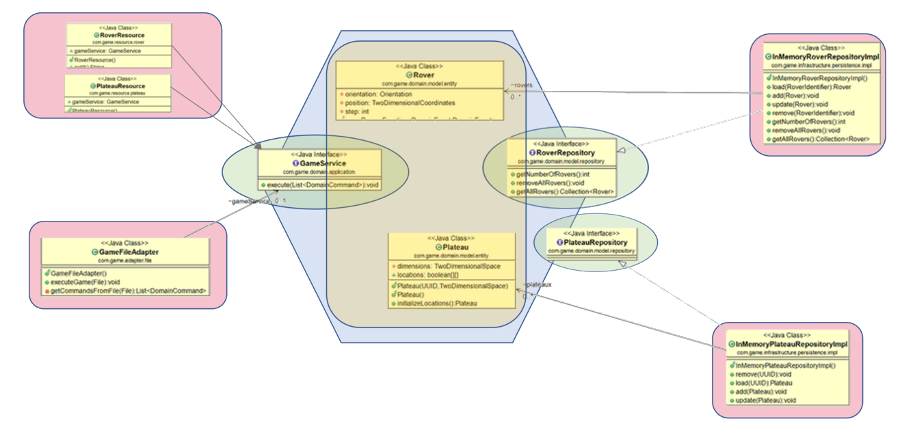

# ROVER Web

This project allows you to send web commands to interact with the [Rover Domain Model](../rover-model), by exposing  RESTful services using `Jersey` deployed in a lightweight container [Grizzly](https://javaee.github.io/grizzly/).

Basically, [Eclipse Jersey](https://eclipse-ee4j.github.io/jersey/) is a REST framework that provides a [JAX-RS (JSR-370)](https://jcp.org/en/jsr/detail?id=370) implementation.

In `Hexagonal Architecture`, this is equivalent to add a second adapter, i.e a JAX-RS adapter (top left pink bloc), in addition to the [GameFileAdapter](../rover-model/src/main/java/com/game/adapter/file/GameFileAdapter.java).

Both adapters communicate with the `Domain Model` via the Primary Port [GameService](../rover-model/src/main/java/com/game/domain/application/service/GameService.java), which resides on the left side of the Hexagon at the boundaries of the `Domain Model`.

It is of first importance that all `Adapters` (pink boxes) point towards the `Model` (and NOT the other way around).




## Quick start

1. Download and install [Maven](http://maven.apache.org/install.html).
2. Clone, build and install the [Rover Domain Model](../rover-model).
3. Clone the current git project
4. The `rover-web` directory contains a standard Maven project structure:
 	 
   Project build and management configuration is described in the `pom.xml` located in the project root directory.
 	
   Project sources are located under `src/main/java`.
 	
   Project test sources are located under `src/test/java`.
 	
5. Run the following maven command: `mvn exec:java`

   This will run the [Main](src/main/java/com/game/Main.java) class responsible for bootstrapping the [Grizzly](https://javaee.github.io/grizzly/) container as well as configuring and deploying the project's JAX-RS application to the container.

The application starts and you should soon see the following notification in your console:

```java
mai 02, 2020 11:19:34 AM org.glassfish.grizzly.http.server.NetworkListener start
INFOS: Started listener bound to [localhost:8080]
Jersey app started with WADL available at http://localhost:8080/game/application.wadl
Hit enter to stop it...
mai 02, 2020 11:19:34 AM org.glassfish.grizzly.http.server.HttpServer start
INFOS: [HttpServer] Started.
```

This informs you that the application has been started and it's WADL descriptor is available at http://localhost:8080/game/application.wadl URL.

Actually, Jersey contains support for [Web Application Description Language (WADL)](https://javaee.github.io/wadl/). WADL is a XML description of a deployed RESTful web application.

You can retrieve the WADL content by executing a `curl http://localhost:8080/game/application.wadl` command in your console or by typing the WADL URL into your favorite browser. 

You should get back an XML document in describing your deployed RESTful application in a WADL format. To learn more about working with WADL, check the [Chapter 18, WADL Support](https://eclipse-ee4j.github.io/jersey.github.io/documentation/latest/wadl.html) chapter. 

## Grizzly container

Our `Jersey` application needs to be deployed in a web container, as it exposes Restful services.

`Jersey` provides a container extension module that enables support for using [Grizzly](https://javaee.github.io/grizzly/)  as a plain vanilla HTTP container that runs JAX-RS applications. `Grizzly` is a multi-protocol framework built on top of Java NIO.

The container extension module dependency to be added in our [pom.xml](pom.xml) is: 

```java
	<dependency>
			<groupId>org.glassfish.jersey.containers</groupId>
			<artifactId>jersey-container-grizzly2-http</artifactId>
		</dependency>
```

Starting a Grizzly server to run a JAX-RS or Jersey application is one of the most lightweight and easy ways how to expose a functional RESTful services application. 

Looking at the [Main](src/main/java/com/game/Main.java) class, we have to do mainly three things:

- define the base URI of our application, in our case `http://localhost:8080/game/`

- create a configuration that scans for JAX-RS resources, in our case the package `com.game.resource`

- start a Grizzly server instance by calling the corresponding factory `GrizzlyHttpServerFactory.createHttpServer(URI.create(BASE_URI), ResourceConfig)`;

```java
 // Base URI the Grizzly HTTP server will listen on
    public static final String BASE_URI = "http://localhost:8080/game/";

    /**
     * Starts Grizzly HTTP server exposing JAX-RS resources defined in this application.
     * @return Grizzly HTTP server.
     */
    public static HttpServer startServer() {
        // create a resource config that scans for JAX-RS resources and providers
        // in com.game package
        final ResourceConfig rc = new ResourceConfig().packages("com.game.resource");

        // create and start a new instance of grizzly http server
        // exposing the Jersey application at BASE_URI
        return GrizzlyHttpServerFactory.createHttpServer(URI.create(BASE_URI), rc);
    }
```

## JAX-RS Resources

With no surprise, we have implemented two JAX-RS Resources, [PlateauResource](src/main/java/com/game/resource/plateau/PlateauResource.java) and [RoverResource](src/main/java/com/game/resource/rover/RoverResource.java). 

Let focus first on `PlateauResource`

```java

/**
 * Root resource (exposed at "v1/plateau" path)
 */
@Path("v1/plateau")
public class PlateauResource {

	GameService gameService = GameContext.getInstance().getGameService();

	/**
	 * Method handling HTTP GET requests. The returned object will be sent to the
	 * client as "text/plain" media type.
	 *
	 * @return String that will be returned as a text/plain response.
	 */
	@GET
	@Produces(MediaType.TEXT_PLAIN)
	public String getIt() {
		return "Got Plateau Resource!";
	}
```
We first define the `@Path` value as the URL at which the Resource will be accessible.

You can notice here the **v1** prefix to handle the web service versioning. In this example, we use the so-called `URI versioning` (the most straightforward versioning) but other approaches are also possible (as explained in this [article](https://restfulapi.net/versioning/)).

As an instance variable, we inject the `Port interface` [GameService](../rover-model/src/main/java/com/game/domain/application/service/GameService.java) by which we will reach the Rover `Domain Model`.

Our first very method implements a usual ping, which tells us that the `PlateauResource` is available.

The `Content-Type` response header (if not set programmatically) will be automatically set based on the media types declared by `@Produces` annotation, here `text/plain`.

The `@GET` annotation is a request method designator, along with `@POST`, `@PUT`, `@DELETE`, and `@HEAD`, defined by JAX-RS and corresponding to the similarly named HTTP methods. In the example, the annotated Java method will process HTTP GET requests. The behavior of a resource is determined by the HTTP method to which the resource is responding.

To test it, you can do a curl on the given URL `curl -v http://localhost:8080/game/v1/plateau`

```java
C:\Users\cyril>curl -v http://localhost:8080/game/v1/plateau
*   Trying ::1...
* TCP_NODELAY set
*   Trying 127.0.0.1...
* TCP_NODELAY set
* Connected to localhost (127.0.0.1) port 8080 (#0)
> GET /game/v1/plateau HTTP/1.1
> Host: localhost:8080
> User-Agent: curl/7.55.1
> Accept: */*
>
< HTTP/1.1 200 OK
< Content-Type: text/plain
< Content-Length: 21
<
Got Plateau Resource!* Connection #0 to host localhost left intact
```

If you are lucky, you get a `200 OK` HTTP Response Code as well as the expected text `Got Plateau Resource!`.

Let us have a look at the method `initializePlateau` by which we can initialize a Plateau via Rest.

By defining the Path's value equal to `/initialize` we want to deploy a resource that responds to the URI path template `http://localhost:8080/game/v1/plateau/initialize/`

Just for information, a `@Path` value isn’t required to have leading or trailing slashes (/). The JAX-RS runtime parses URI path templates the same whether or not they have leading or trailing spaces.

Three things important to note here:

- We do NOT interact with the client through the application objects. Even if the Application Command objects do not belong to the Model itself, we do NOT want to expose them directly to the external clients. We have to map the Application commands to client specific `Dtos`, in our case [PlateauInitializeCommandDto](src/main/java/com/game/resource/plateau/dto/PlateauInitializeCommandDto.java).

- The `@Consumes` annotation is used to specify the MIME media types of representations that can be consumed by a resource, in our case `Json`.

- A common RESTful pattern for the creation of a new resource is to support a POST request that returns a **201 (Created) status code** and a **Location header** whose value is the URI to the newly created resource (cf [Jersey user guide](https://eclipse-ee4j.github.io/jersey.github.io/documentation/latest/user-guide.html#d0e6317))

```java
@POST
@Path("initialize")
@Consumes(MediaType.APPLICATION_JSON)
public Response initializePlateau(PlateauInitializeCommandDto commandDto) {

	// map to application command PlateauInitializeCommand 
	PlateauInitializeCommand command = new PlateauInitializeCommand.Builder()
			.withId(UUID.fromString(commandDto.getUuid())).withWidth(commandDto.getWidth())
			.withHeight(commandDto.getHeight()).build();
	
	// call the Port for creation/initialization
	gameService.execute(command);
	
	// return the Response with status 201 = created + location header with UUID of the created resource
	URI createdUri = URI.create(Main.BASE_URI + "v1/plateau/" + commandDto.getUuid());
	return Response.created(createdUri).build();
	
}
```

You can do a curl with the following URI and data

```java
curl -v  POST -H "Content-Type: application/json" -d "{\"uuid\": \"53567a5d-a21c-495e-80a3-d12adaf8585c\", \"width\": 5, \"height\": 5}" http://localhost:8080/game/v1/plateau/initialize
```
 and you should something similar into your console:
 
```java
*   Trying 127.0.0.1...
* TCP_NODELAY set
* Connected to localhost (127.0.0.1) port 8080 (#1)
> POST /game/v1/plateau/initialize HTTP/1.1
> Host: localhost:8080
> User-Agent: curl/7.55.1
> Accept: */*
> Content-Type: application/json
> Content-Length: 73
>
* upload completely sent off: 73 out of 73 bytes
< HTTP/1.1 201 Created
< Location: http://localhost:8080/game/v1/plateau/53567a5d-a21c-495e-80a3-d12adaf8585c
< Content-Length: 0
<
* Connection #1 to host localhost left intact
```

As expected, we get a `201 Created` response status as well as the `Location` header set to: `http://localhost:8080/game/v1/plateau/53567a5d-a21c-495e-80a3-d12adaf8585c`.

JAX-RS rocks! ;-)

Now let's have a look at our [RoverResource](src/main/java/com/game/resource/rover/RoverResource.java)

The way to create a Resource should be now familiar:
 
 - we map the web DTO command to the Application command
 - we delegate the command execution to the primary `Port interface` [GameService](../rover-model/src/main/java/com/game/domain/application/service/GameService.java)
 - we return a JAX-RS `Response` object with Status=201 and newly created resource URI on the `Location` header

```java
@POST
@Path("initialize")
@Consumes(MediaType.APPLICATION_JSON)
public Response initializeRover(RoverInitializeCommandDto commandDto) {

	// map the web Dto command to application command RoverInitializeCommand 
	RoverInitializeCommand command = new RoverInitializeCommand.Builder()
			.withPlateauUuid(commandDto.getPlateauUuid()).withName(commandDto.getName())
			.withAbscissa(commandDto.getAbscissa()).withOrdinate(commandDto.getOrdinate())
			.withOrientation(commandDto.getOrientation().charAt(0)).build();

	// call the Application Primary Port for creation/initialization
	gameService.execute(command);

	// return the Response with status 201 = created + location header with UUID of
	// the created resource/rover
	URI createdUri = URI.create(new StringBuilder(Main.BASE_URI).append("v1/rover/").append(commandDto.getName())
			.append("/").append(commandDto.getPlateauUuid()).toString());
	return Response.created(createdUri).build();

}
	
```
You can test this resource with a simple Curl command

```java
curl -v  POST -H "Content-Type: application/json" -d "{\"plateauUuid\": \"53567a5d-a21c-495e-80a3-d12adaf8585c\", \"name\": \"ROVER_TEST\", \"abscissa\": 2, \"ordinate\": 3, \"orientation\": \"N\"}" http://localhost:8080/game/v1/rover/initialize
```
As expected, we receive a HTTP 201 Status along with the URI of the newly created `Rover` under the `Location` header:

`Location: http://localhost:8080/game/v1/rover/ROVER_TEST/53567a5d-a21c-495e-80a3-d12adaf8585c`

```java
C:\Users\cyril>curl -v  POST -H "Content-Type: application/json" -d "{\"plateauUuid\": \"53567a5d-a21c-495e-80a3-d12adaf8585c\", \"name\": \"ROVER_TEST\", \"abscissa\": 2, \"ordinate\": 3, \"orientation\": \"N\"}" http://localhost:8080/game/v1/rover/initialize
* Rebuilt URL to: POST/
* Could not resolve host: POST
* Closing connection 0
curl: (6) Could not resolve host: POST
*   Trying ::1...
* TCP_NODELAY set
*   Trying 127.0.0.1...
* TCP_NODELAY set
* Connected to localhost (127.0.0.1) port 8080 (#1)
> POST /game/v1/rover/initialize HTTP/1.1
> Host: localhost:8080
> User-Agent: curl/7.55.1
> Accept: */*
> Content-Type: application/json
> Content-Length: 127
>
* upload completely sent off: 127 out of 127 bytes
< HTTP/1.1 201 Created
< Location: http://localhost:8080/game/v1/rover/ROVER_TEST/53567a5d-a21c-495e-80a3-d12adaf8585c
< Content-Length: 0
<
* Connection #1 to host localhost left intact
```
To make sure the `Rover` has been made persistent in our Application, we can call the following `getRover` method, uniquely identified by `@Path("{name}/{plateauId}")`

```java
@GET
@Path("{name}/{plateauId}")
@Produces(MediaType.APPLICATION_JSON)
public RoverDto getRover(@PathParam("name") String name, @PathParam("plateauId") String plateauId) {

	RoverIdentifier roverIdentifier = new RoverIdentifier(UUID.fromString(plateauId), name);
	RoverGetCommand command = new RoverGetCommand(roverIdentifier);
	Rover rover = gameService.execute(command);
	return new RoverDto(rover.getId().getName(), rover.getId().getPlateauId().toString(),
			rover.getOrientation().getValue(), rover.getXPosition(), rover.getYPosition());
}
```

Let us execute the corresponding Curl command, by filling the required `Rover Name` and `Plateau Uuid` parameter values

```java
curl -v  GET -H "Content-Type: application/json" http://localhost:8080/game/v1/rover/ROVER_TEST53567a5d-a21c-495e-80a3-d12adaf8585c
```

We get the expected [RoverDto](src/main/java/com/game/resource/rover/dto/RoverDto.java) instance in `Json` format

```java
C:\Users\cyril>curl -v  GET -H "Content-Type: application/json" http://localhost:8080/game/v1/rover/ROVER_TEST/53567a5d-a21c-495e-80a3-d12adaf8585c
* Rebuilt URL to: GET/
* TCP_NODELAY set
*   Trying 127.0.0.1...
* TCP_NODELAY set
* Connected to localhost (127.0.0.1) port 8080 (#1)
> GET /game/v1/rover/ROVER_TEST/53567a5d-a21c-495e-80a3-d12adaf8585c HTTP/1.1
> Host: localhost:8080
> User-Agent: curl/7.55.1
> Accept: */*
> Content-Type: application/json
>
< HTTP/1.1 200 OK
< Content-Type: application/json
< Content-Length: 118
<
{"abscissa":2,"name":"ROVER_TEST","ordinate":3,"orientation":"N","plateauUuid":"53567a5d-a21c-495e-80a3-d12adaf8585c"}

* Connection #1 to host localhost left intact
```

## Exception Handling

A RESTful API service may throw exception in many cases.

It’s important to handle them properly, so that we can provide a right HTTP response to the client, in particular a right status code (4xx or 5xx errors) and a correct entity.

Before talking about exception mapper, we first need to understand the concept of provider. Providers in JAX-RS are responsible for various cross-cutting concerns such as filtering requests, converting representations into Java objects, mapping exceptions to responses, etc. 

By default, a single instance of each provider class is instantiated for each JAX-RS application, aka singletons.

Interface `ExceptionMapper<E extends Throwable>` defines a contract for a provider that maps Java exceptions `E` to `javax.ws.rs.core.Response`. Same as other providers, exception mappers can be either pre-packaged in the JAX-RS runtime or supplied by an application. 

In order to create our own exception mapper, we need to create a class which implements interface `ExceptionMapper`.

Here's an example of [EntityNotFoundMapper](src/main/java/com/game/exception/EntityNotFoundMapper.java) for mapping [EntityNotFoundException](../rover-model/src/main/java/com/game/domain/model/exception/EntityNotFoundException.java) in our  application:

```java
@Provider
public class EntityNotFoundMapper implements ExceptionMapper<EntityNotFoundException> {

	@Override
	public Response toResponse(EntityNotFoundException exception) {
		return Response.status(404).entity(exception.getMessage()).type("text/plain").build();
	}

}
```

The above class is annotated with `@Provider`, this declares that the class is of interest to the JAX-RS runtime. 

Such a class may be added to the set of classes of the Application instance that is configured. In our case, it is done in our [Main](src/main/java/com/game/Main.java) class, by adding the package `com.game.exception` where reside all the exception mappers, to the `ResourceConfig` object.

```java
  public static HttpServer startServer() {
    // create a resource config that scans for JAX-RS resources and providers
    // in com.game package
    final ResourceConfig rc = new ResourceConfig().packages("com.game.resource", "com.game.exception");

    // create and start a new instance of grizzly http server
    // exposing the Jersey application at BASE_URI
    return GrizzlyHttpServerFactory.createHttpServer(URI.create(BASE_URI), rc);
}
```

When an application throws an `com.game.domain.model.exception.EntityNotFoundException`, the `toResponse` method of the `EntityNotFoundMapper` instance will be invoked. 

Let us test this behaviour by invoking the GET method for an not existing Plateau

```java
curl -v  GET -H "Content-Type: application/json" http://localhost:8080/game/v1/plateau/53567a5d-a21c-495e-80a3-d12adaf8585c/
```
We get the expected Application Error Message in our Response `[ERR-002] Entity [Plateau] with Id [53567a5d-a21c-495e-80a3-d12adaf8585c] not found in the Application Repository`

```java
C:\cyril\rover-project\rover-web>curl -v  GET -H "Content-Type: application/json" http://localhost:8080/game/v1/plateau/53567a5d-a21c-495e-80a3-d12adaf8585c/
* Rebuilt URL to: GET/
* Connected to localhost (127.0.0.1) port 8080 (#1)
> GET /game/v1/plateau/53567a5d-a21c-495e-80a3-d12adaf8585c/ HTTP/1.1
> Host: localhost:8080
> User-Agent: curl/7.55.1
> Accept: */*
> Content-Type: application/json
>
< HTTP/1.1 404 Not Found
< Content-Type: text/plain
< Content-Length: 113
<
[ERR-002] Entity [Plateau] with Id [53567a5d-a21c-495e-80a3-d12adaf8585c] not found in the Application Repository
* Connection #1 to host localhost left intact
```
		
